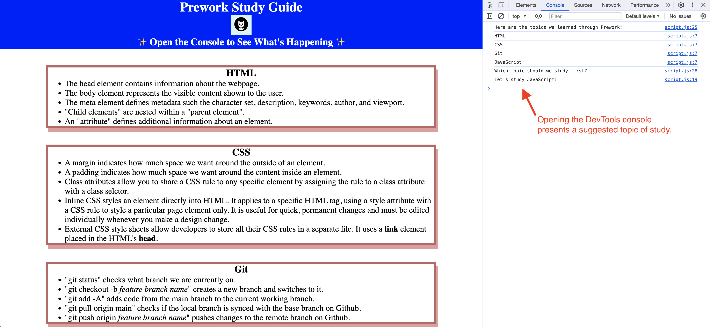

# My Pre-work Study Guide Webpage

## Description

As a bootcamp student and novice coder, it is critical to have a repository in which to store and organize notes. This pre-work study guide serves as a journal to note relevant information during the coding course.
This journal contains information to remind and reinforce key terms and topics necessary to begin the bootcamp course.
Construction of this webpage introduces bootcamp students to each of the building blocks of coding applications (HTML, CSS, Git, and JavaScript).

## Installation

N/A

## Usage

Opening the Pre-work Study Guide displays each subject of study (HTML, CSS, Git, and JavaScript) and information relevant to that topic.
Usage of the Chrome DevTools console, by pressing Command+Option+I (macOS) or Control+Shift+I (Windows), will access the active JavaScript via a console panel either below or to the side of the webpage in the browser. The console will display each of the study topics and present a suggested area to begin study.

## Credits

N/A

## License

The last section of a high-quality README file is the license. This lets other developers know what they can and cannot do with your project. If you need help choosing a license, refer to [https://choosealicense.com/](https://choosealicense.com/).